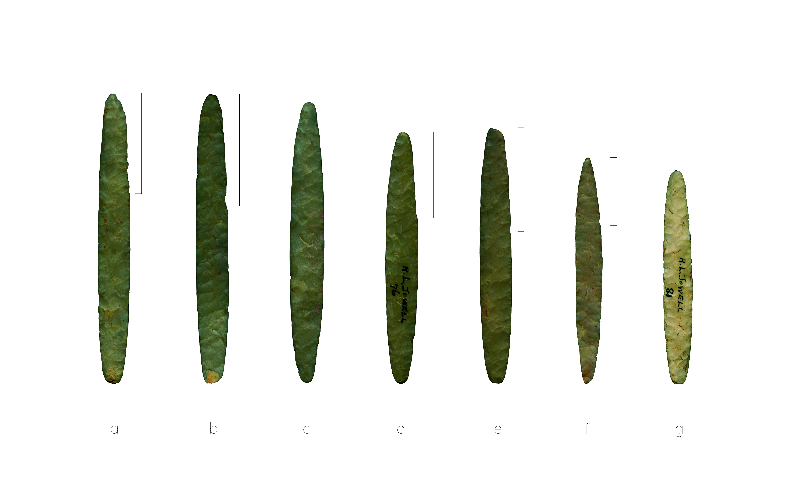

# elliptical.bifaces

## Size matters: Divergent morphology in elliptical bifaces from sites in the American Southeast articulates with distinct local reduction practices

### Abstract:

Elliptical bifaces from Millsap Cache and Jowell Farm (41AN13) comprise two of the largest samples of this ill-understood stone tool from the ancestral Caddo area. Elliptical bifaces from Jowell Farm (n = 11) were manufactured using Edwards chert, and are thought to have been acquired by the Caddo through trade or exchange with central Texas groups. Bifaces from Millsap Cache (n = 19) were reportedly manufactured from Kay County flint, providing for an empirical test of whether biface morphology differs as a function of raw material. The sample of elliptical bifaces from each site was also divided into two size classes; one conceptually reflective of production (large), and the other with local reduction practices (small). Size classes were used to assess whether modifications by Caddo knappers may have yielded similar---convergent---biface shape in the small class. Size classes were also used to test the hypothesis that greater morphological variation would be apparent in the small class due to idiosyncratic responses related to local retouch practices. Results demonstrate that elliptical biface shape does not differ by raw material, but size does. This suggests a shared, and consistent, mental template that was maintained independent of biface size. The subsequent analysis of elliptical biface morphology by size class demonstrated that size does not differ by raw material in the large class, but in the small class, it does. This finding supports the argument that elliptical biface morphology diverges through local reduction practices. As expected, greater shape diversity occurs in the small class, where Jowell Farm bifaces were found to be more morphologically diverse than those from Millsap Cache. Distinct local reduction practices are advanced as the driver of extant morphological differences found in elliptical bifaces from the ancestral Caddo area of the American Southeast.

### Keywords {-}

American Southeast, Caddo, Jowell biface, archaeology, archaeoinformatics, museum studies, digital humanities, geometric morphometrics, STEM, STEAM

