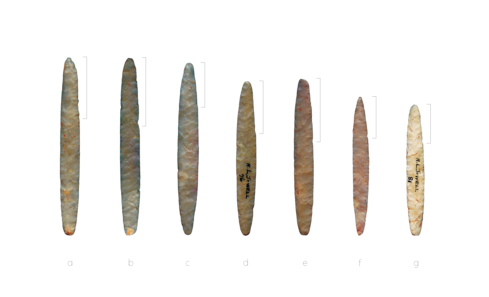
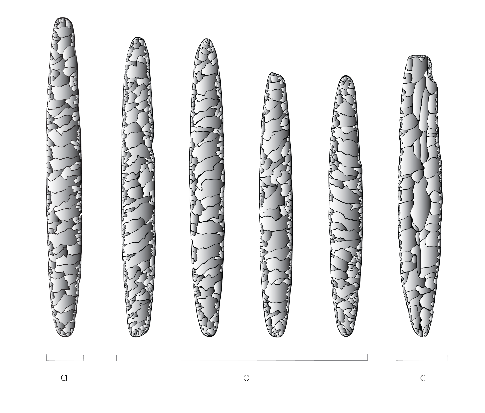

# elliptical.bifaces

## Size matters: Divergent morphology in elliptical bifaces from sites in the American Southeast articulates with distinct local reduction practices

### Abstract:

Elliptical bifaces are prevalent at Mississipian sites throughout the American Southeast. Those from Millsap Cache and Jowell Farm comprise two of the largest samples of this ill-understood stone tool from the ancestral Caddo area. Bifaces from Millsap Cache were reportedly produced using Kay County flint, while those from Jowell Farm were manufactured using Edwards chert, providing for an empirical test of morphological differences as a function of raw material. The sample of elliptical bifaces was divided into two size classes; one conceptually reflective of production (large), and the other with local reduction practices (small). Size classes were used to assess whether modifications by Caddo knappers may have yielded similar---convergent---biface shapes in the small class. Size classes were also used to test the hypothesis that greater morphological variation would be apparent in the small class due to idiosyncratic responses related to local retouch practices. Results demonstrate that elliptical biface shape does not differ by raw material, but size does, suggesting that a shared and morphologically-consistent mental template was maintained independent of biface size. The subsequent analysis of elliptical biface morphology by size class demonstrated that size does not differ by raw material in the large class, but in the small class, it does. This finding supports the argument that elliptical biface morphology diverges through local reduction practices. As expected, greater shape diversity occurs in the small class, where Jowell Farm bifaces were found to be more morphologically diverse than those from Millsap Cache. Distinct local reduction practices are advanced as the driver of extant morphological differences found in elliptical bifaces.  

### Keywords

American Southeast, Caddo, NAGPRA, archaeoinformatics, museum studies, digital humanities, non-Western art history, geometric morphometrics, STEM, STEAM, ovoid biface, Jowell knife, Jowell knives, lithics, oblique parallel flaking

