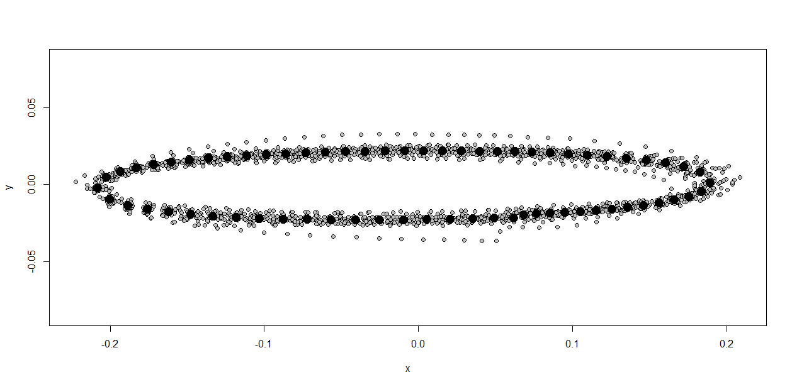
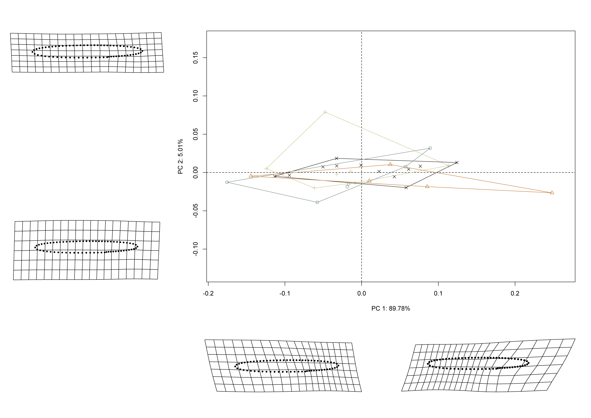

# Preface {-}

>Reproducibility---the ability to recompute results---and replicability---the chances other experimenters will achieve a consistent result---are two foundational characteristics of successful scientific research [@RN20918].

Elliptical bifaces from Millsap Cache and Jowell Farm (41AN13) comprise two of the largest samples of this ill-understood lithic artefact from the ancestral Caddo area. Elliptical bifaces from Jowell Farm were manufactured using Edwards chert, and are thought to have been acquired by the Caddo through trade or exchange with central Texas groups. Bifaces from Millsap Cache were reportedly manufactured from Kay County flint, providing for an empirical test of whether biface morphology differs as a function of raw material. The sample of elliptical bifaces from each site was also divided into two size classes; one reflective of production (large), and the other associated with retouch (small). Size classes were used to assess whether modifications by Caddo knappers may have yielded similar---convergent---biface shape in the small class. They were also used to test the hypothesis that greater morphological variation would be apparent in the small class due to idiosyncratic responses related to local retouch practices. Results demonstrate that elliptical biface shape does not differ by raw material, but size does. This suggests a shared, and consistent, mental template that was maintained independent of biface size. The subsequent analysis of elliptical biface morphology by size class demonstrated that size does not differ by raw material in the large class, but in the small class, it does. This finding supports the argument that elliptical biface morphology diverges through local reduction practices. As expected, greater shape diversity occurs in the small class, where Jowell Farm bifaces were found to be more morphologically diverse than those from Millsap Cache. Distinct local reduction practices are advanced as the driver of extant morphological differences found in elliptical bifaces from the ancestral Caddo area of the American Southeast.

### Keywords {-}

American Southeast, Caddo, Jowell biface, archaeology, archaeoinformatics, museum studies, digital humanities, geometric morphometrics, STEM, STEAM

```{r figmap, fig.cap="Geological map illustrating the location of the Millsap Cache and Jowell Farm, and the level three ecoregions of the Arkansas Valley (blue), Ouachita Mountains (yellow), and South Central Plains (orange) in the ancestral Caddo area (white) of the American Southeast."}

knitr::include_graphics('./images/map.png')
```

## Analysis overview

Prior to landmarking, elliptical bifaces were oriented with the most heavily retouched edge at top right (Figure \@ref(fig:figlm)). The landmarking protocol uses three landmarks; two horizontal tangents (top/bottom), and the third placed at the furthest extent of the edge with the heaviest amount of retouch. Landmarks and semilandmarks were applied using the `StereoMorph` package [@RN8973]. Some bifaces include multiple areas of heavy retouch at the top and bottom of the same lateral edge (Figure \@ref(fig:figlm): b, c, d, and e), while others (Figure \@ref(fig:figlm): f) include one retouched edge at top right and another at bottom left, similar to alternately beveled bifaces.

```{r figlm, fig.cap="Selected elliptical bifaces from the Jowell Farm site highlighting the most heavily retouched area identified using a modified version of the flaking index developed and advanced by Miller [-@RN11459], Smallwood [-@RN8310], and Miller and Smallwood [-@RN11460]."}

knitr::include_graphics('./images/ellipticalbifaces.jpg')
```

To identify which edge was most heavily retouched, we employed a modified approach to the flaking index initially developed by Miller [-@RN11459], and later advanced and refined by Smallwood [-@RN8310], then Miller and Smallwood [-@RN11460]. The modified approach uses counts of flake scars from each edge in the two most heavily worked areas, paired with a measure of edge length (inclusive of curvature - this is not a linear metric). The number of flake scars was then divided by the length of the worked edge, with the heaviest worked edge identified by the greater value.

The longest reworked edge on the elliptical bifaces was almost always more heavily retouched. This finding was used to incorporate the images of elliptical bifaces from Millsap Cache [@RN11461], where the longest reworked edge was oriented at top right prior to landmarking.

### Generalised Procrustes Analysis

Landmark data were aligned to a global coordinate system [@RN11622;@RN11623;@RN11563], achieved through generalized Procrustes superimposition [@RN478] performed in R 4.2.1 [@R] using the `geomorph` library v. 4.0.4 [@RN11530;@RN1774;@RN9565]. Procrustes superimposition translates, scales, and rotates the coordinate data to allow for comparisons among objects [@RN11564;@RN478]. The `geomorph` package uses a partial Procrustes superimposition that projects the aligned specimens into tangent space following alignment in preparation for the use of multivariate methods that assume linear space [@RN1646;@RN11563].

```{r figgpa, out.width = "100%", dpi = 300, fig.cap="Results of generalised Procrustes analysis for elliptical bifaces from the Millsap Cache and Jowell Farm. Mean consensus configuration shown in black; individual bifaces in gray."}

```

### Principal Components Analysis

Principal components analysis [@RN1746] was used to visualise shape variation among the elliptical bifaces. The shape changes described by each principal axis are commonly visualized using thin-plate spline warping of a reference image or 3D mesh [@RN1731;@RN479].

```{r figpca, out.width = "100%", dpi = 300, fig.cap="PCA summarizing shape variation in elliptical bifaces."}

```

### Procrustes ANOVA

To assess whether `shape` changes with `size` (allometry), and whether shape and size differed by `raw material` and `size class`, Procrustes ANOVAs [@RN1749] were run that enlist effect-sizes (zscores) computed as standard deviates of the generated sampling distributions [@RN1756]. A residual randomization permutation procedure (RRPP; n = 10,000 permutations) was used for all Procrustes ANOVAs [@RN1655;@RN11775], which has higher statistical power and a greater ability to identify patterns in the data should they be present [@RN1719].

### Morphological disparity

An analysis of morphological disparity was used to identify potential differences in morphological diversity between size classes [@RN11107;@RN7041;@RN5694].

## Primary findings

  -   Bifaces _do not differ_ in shape, but **differ significantly** in size by raw material.
  -   Allometry (shape change with size) was not significant.
  -   Bifaces in the _large class_ recovered from Millsap Cache and Jowell Farm do not differ in shape or size, suggesting consistent morphology in bifaces from the _large class_, supporting arguments for production-based standardization.
  -   Bifaces in the _small class_ recovered from Millsap Cache and Jowell Farm **differ significantly** in size. Thus, while shape remains consistent, size differs, suggesting---at minimum---locally divergent approaches to retouch.
  -   Morphological disparity in the shape of the _small class_ is **significantly greater** at Jowell Farm, providing evidence for a more standardized approach to local retouch at Millsap Cache. This finding also provides support for the hypothesis that greater shape diversity is associated with retouch efforts, rather than production.

### Summary

The shape of elliptical bifaces does not differ significantly in either size class; however, size does. Results of the Procrustes ANOVAs support the hypothesis for divergent morphology. The analysis of morphological disparity yielded support for the interpretation that greater morphological diversity is associated with local retouch, while providing additional support for morphological consistency related to production. 

## Acknowledgments

Our thanks to the Caddo Nation of Oklahoma, the Caddo Nation Tribal Council, Tribal Chairman, and Tribal Historic Preservation Office for permission and access to NAGPRA and previously repatriated collections. Our gratitude is also extended to Marybeth Tomka and Lauren Bussiere at the Texas Archeological Research Laboratory for their assistance with access to the bifaces and the associated records, to Sergio Ayala and the Gault School of Archaeological Research for access to the UV light, and to Scott Hammerstedt and Debra K. Green at the Oklahoma Archeological Survey for their assistance with records requests. Thanks also to John Harman for access to the DStretch plugin for ImageJ that was useful in the analysis of flake scars, and to Harry J. Shafer, Hiram F. (Pete) Gregory, Christian S. Hoggard, and David K. Thulman for their comments and constructive criticisms on the ongoing analyses of Caddo biface morphology, as well as Emma Sherratt, Kersten Bergstrom, Dean C. Adams, and Michael L. Collyer for their constructive criticisms, general comments, and suggestions throughout the development of this research program.

## Funding

Components of this analytical work flow were developed and funded by a Preservation Technology and Training grant (P14AP00138) to RZS from the National Center for Preservation Technology and Training (NCPTT), and additional grants to RZS from the Caddo Nation of Oklahoma, National Forests and Grasslands in Texas (15-PA-11081300-033) and the United States Forest Service (20-PA-11081300-074). Funding to analyse the bifaces from Millsap Cache and Jowell Farm was provided by the Heritage Research Center at Stephen F. Austin State University.

## Data management

The analysis code associated with this project can be accessed through this document, is available in the GitHub repository ([https://github.com/seldenlab/elliptical.bifaces](https://github.com/seldenlab/elliptical.bifaces)), and digitally curated on the Open Science Framework ([DOI 10.17605/OSF.IO/PH25W](https://osf.io/ph25w/)). The reproducible nature of this enterprise provides a means for others to critically assess and evaluate the various analytical components [@RN20915;@RN20916;@RN20917], which is a necessary requirement for the production of reliable knowledge.

Reproducibility projects in [psychology](https://osf.io/ezcuj/) and [cancer biology](https://www.cos.io/rpcb) are impacting current research practices across all domains. Examples of reproducible research are becoming more abundant in archaeology [@RN20804;@RN21009;@RN11783;@RN21001;@RN9364;@RN11264], and the next generation of archaeologists are learning those tools and methods needed to reproduce and/or replicate research results [@RN21007]. Reproducible and replicable research work flows are often employed at the highest levels of humanities-based inquiries to mitigate concern or doubt regarding proper execution, and is of particular import should the results have---explicitly or implicitly---a major impact on scientific progress [@RN21008].

## Colophon

This version of the analysis was generated on `r Sys.time()` using the following computational environment and dependencies: 

```{r colophon, cache = FALSE}
# what R packages and versions were used?
if ("devtools" %in% installed.packages()) devtools::session_info()
```

Current Git commit details are:

```{r}
# where can I find this commit? 
if ("git2r" %in% installed.packages() & git2r::in_repository(path = ".")) git2r::repository(here::here())  
```
